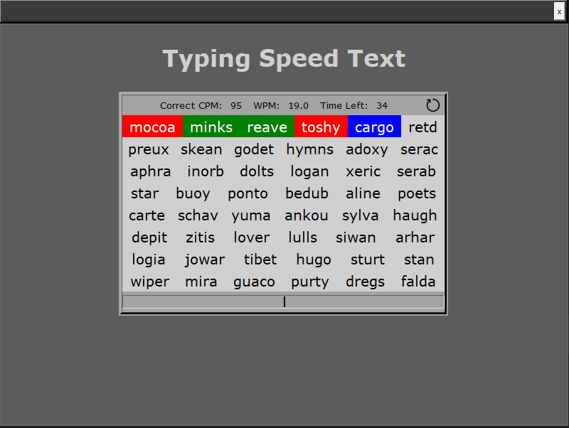

# Typing Speed Test
A modern typing speed test application built with Python and Tkinter, featuring real-time statistics, word management, and a sleek dark-themed interface.


## 🎯 Overview
A professional typing test application that provides:
1. Real-time WPM and CPM tracking
2. 60-second timed tests
3. Word accuracy tracking
4. Character accuracy tracking
5. Instant visual feedback

## 📸 Application Preview



*The application features a modern dark theme interface with real-time statistics display*

Key elements shown:
- Clean, dark-themed interface
- Real-time WPM/CPM tracking
- Word display area
- Progress indicators
- Timer display
- Input field

## 🚀 Features
### Testing System
- 60-second timed tests
- Random 4-5 letter words
- Real-time statistics
- Word-by-word feedback
- Continuous word generation

### Statistics Tracking
- Words Per Minute (WPM)
- Characters Per Minute (CPM)
- Word accuracy percentage
- Character accuracy percentage
- Real-time updates

## 💻 Interface Features
### Modern UI Elements
- Dark theme interface
- Movable window
- Clean typography
- Color-coded feedback
- Progress indicators

### Test Display
- Multi-line word display
- Current word highlighting
- Error indication
- Progress tracking
- Real-time stats

## 🎮 How to Use
1. Launch the application
2. Type the highlighted word
3. Press space to submit word
4. Watch your statistics in real-time
5. Complete the 60-second test

### Color Indicators
- Blue: Current word
- Green: Correct typing
- Red: Incorrect typing
- Gray: Upcoming words

## 🔧 Technical Details
### Typing Statistics
```python
def calculate(self):
    raw_cpm = self.typed_character_count
    correct_cpm = self.correct_character_count
    raw_wpm = raw_cpm/5
    correct_wpm = correct_cpm/5
    
    if self.typed_character_count > 0:
        correct_word_percent = float(self.correct_word_count / self.all_word_count)
        incorrect_word_percent = float(self.incorrect_word_count / self.all_word_count)
        correct_char_percent = float(self.correct_character_count / self.typed_character_count)
        incorrect_char_percent = float(self.incorrect_character_count / self.typed_character_count)
```

## 🛠️ Project Structure
```
typing-speed-test/
├── main.py              # Application entry
├── game_manager.py      # Test logic
├── type_body_manager.py # Word management
├── words_alpha.txt      # Word database
└── restart_icon.png     # UI assets
```

## 📊 Features
### Test Management
- Timed test control
- Word generation
- Score calculation
- Progress tracking
- Result display

### Word Processing
- Random selection
- Length filtering
- Display management
- Error checking
- Real-time feedback

## 🎯 Test Results
At the end of each 60-second test, you'll see:
- Raw CPM and WPM
- Correct CPM and WPM
- Word accuracy percentage
- Character accuracy percentage
- Overall statistics

## 📝 License
This project is licensed under the MIT License - see the [LICENSE](LICENSE) file for details.

## 👥 Author
Burak TÜZEL